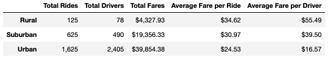
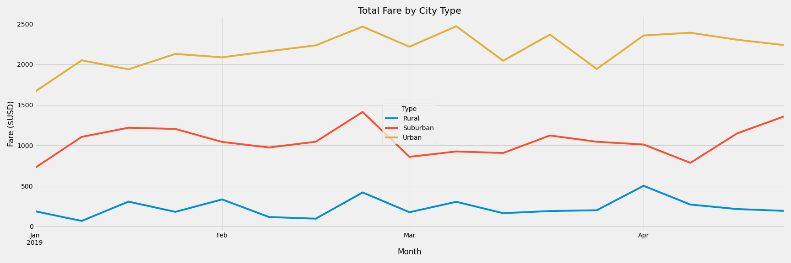

# PyBer Analysis

## Project Overview
After completing our initial project to provide our PyBer boss, V. Isualize, with a plethora of different company analyses, Omar and I were given a new project to look at ride-sharing data across different city types. After providing a summary table to compare company metrics across Urban, Suburn, and Rural cities, we were more specifically asked to investigate total weekly fares paid by city type (Urban, Suburan, and Rural) to figure out what areas we receive the most revenue from on a monthly basis. 

## Results
After grouping our company data by city type and formating the information in a more digestible manner, we created the following summary table:

Upon further investigation of the analysis, we noted a few things:
  - 1. Most of riders and drivers are heavily concentrated in urban cities, making up 68% of our riders and 81% of our drivers. 
  - 2. Most of our revenue in the amount of total fares comes from urban cities (63%). 
  - 3. Due to the higher concentration of riders and drivers in the urban areas, the average fare per rider and driver is lower than the outlying suburban and rural areas. However, the average fare per rider between urban and rural areas is only a $10 difference while the divide in average fare per driver is much larger, almost $40!
  - 4. Due to the much higher concentration of drivers in the urban areas (81% of total), we believe the competition drives down the income each driver can receive. However, the rural drivers seem to have a much larger monopoly on the area and can bring in more revenue per ride.

After completing our secondary analyis of weekly fares paid by city type (seen above), we concluded:
  - There is a significant gap in weekly fares paid between urban cities and surburban/rural citeis, regardless of the time of the year (albeit, this is smaller sample size of only first four months of the year). 

## Summary
Based on the results above, Omar and I recommend three possible business decisions to address the disparities between city types:
- 1. Provide incentives for drivers to venture out to rural areas to decompress the high concentration of urban drivers, which can allow us to raise prices in high demand urban areas and potentially grow our rural based business as there are more drivers availabe to rural customers.
- 2. Given the high demand for our drivers in urban centers will most likely remain stable, provide discounts in our rural and suburban areas to grow our customer base. 
- 3. With less drivers in our urban areas to siphon off fares from each other, encourage new hires given the higher revenue opportunities in conjunction with expanding our services to include food delivery or other services.
